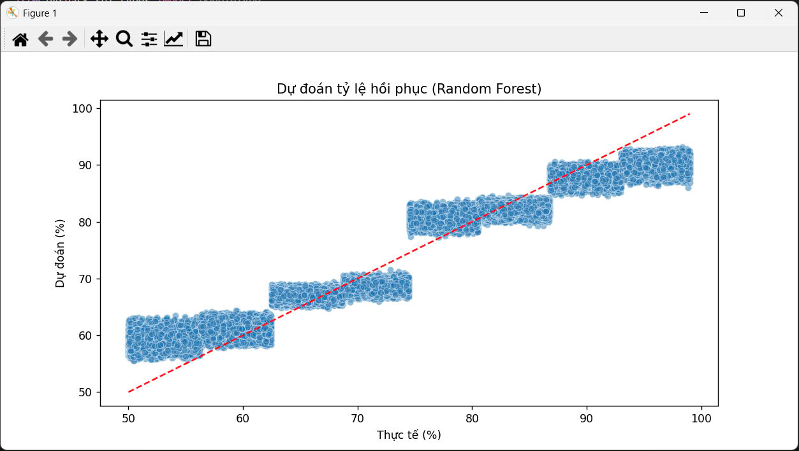

# Dự án Phân tích Dữ liệu Sức khỏe Toàn cầu

Dự án này sử dụng Apache Spark và Python để phân tích dữ liệu thống kê sức khỏe toàn cầu, xử lý giá trị thiếu, phát hiện ngoại lệ, thực hiện phân tích khám phá dữ liệu (EDA), và xây dựng các mô hình dự đoán cho tỷ lệ tử vong và tỷ lệ hồi phục.  
Mã bao gồm trực quan hóa dữ liệu bằng Matplotlib và Seaborn.

## Yêu cầu trước

- **Python 3.x**  
- **Apache Spark** (đã cài đặt và cấu hình)  
- **Thư viện**: `pyspark`, `pandas`, `matplotlib`, `seaborn`  
- **Tệp dữ liệu**: `Global Health Statistics.csv` nằm tại `D:/BTL/`

### Cài đặt

1. Cài đặt các thư viện Python cần thiết:  
   ```bash
   pip install pyspark pandas matplotlib seaborn
# Bước 1: Nhập các thư viện cần thiết
```bash
from pyspark.sql import SparkSession
from pyspark.sql.functions import col, mean, when, isnull
from pyspark.sql.types import DoubleType
from pyspark.ml.feature import VectorAssembler, StandardScaler
from pyspark.ml.regression import LinearRegression, RandomForestRegressor
from pyspark.ml.evaluation import RegressionEvaluator
import pandas as pd
import matplotlib.pyplot as plt
import seaborn as sns
from pyspark.sql import functions as F
```
# Bước 2: Tạo phiên Spark
```bash
spark = SparkSession.builder \
    .appName("GlobalHealthAnalysis") \
    .master("local[*]") \
    .getOrCreate()
```
# Bước 3: Đọc dữ liệu
```bash
data_path = "D:/BTL/Global Health Statistics.csv"
df = spark.read.csv(data_path, header=True, inferSchema=True)
print("Lược đồ của dữ liệu:")
df.printSchema()
```
# Bước 4: Xử lý giá trị thiếu
```bash
numeric_cols = ["Prevalence Rate (%)", "Incidence Rate (%)", "Mortality Rate (%)", "Recovery Rate (%)",
                "Doctors per 1000", "Hospital Beds per 1000", "Population Affected",
                "Per Capita Income (USD)", "Education Index", "Urbanization Rate (%)",
                "Healthcare Access (%)", "Average Treatment Cost (USD)", "DALYs",
                "Improvement in 5 Years (%)"]
existing_cols = [c for c in numeric_cols if c in df.columns]
missing_cols = [c for c in numeric_cols if c not in df.columns]
if missing_cols:
    print("\nCác cột không tồn tại trong dataset:", missing_cols)
numeric_cols = existing_cols
for c in numeric_cols:
    mean_val = df.select(mean(c).alias("mean_val")).collect()[0]["mean_val"]
    df = df.withColumn(c, when(isnull(col(c)), mean_val).otherwise(col(c)))
```
# Bước 5: Xử lý ngoại lệ
```bash
def remove_outliers_iqr(df, col_name):
    quantiles = df.approxQuantile(col_name, [0.25, 0.75], 0.05)
    if len(quantiles) < 2:
        return df
    Q1, Q3 = quantiles
    IQR = Q3 - Q1
    lower_bound = Q1 - 1.5 * IQR
    upper_bound = Q3 + 1.5 * IQR
    return df.filter((col(col_name) >= lower_bound) & (col(col_name) <= upper_bound))
for c in numeric_cols:
    df = remove_outliers_iqr(df, c)
```
# Bước 6: Phân tích khám phá dữ liệu (EDA)
```bash
global_trend = df.groupBy("Year").agg(F.mean("Prevalence Rate (%)").alias("Prevalence Rate Average")).toPandas()
mortality_by_country = df.groupBy("Country") \
    .agg(F.mean("Mortality Rate (%)").alias("Mortality Rate Average")) \
    .orderBy(F.desc("Mortality Rate Average")) \
    .limit(10) \
    .toPandas()
```
# Bước 7: Kỹ thuật đặc trưng
```bash
if "Doctors per 1000" in numeric_cols and "Hospital Beds per 1000" in numeric_cols:
    df = df.withColumn("Doctors_Beds_Interact", col("Doctors per 1000") * col("Hospital Beds per 1000"))
    numeric_cols.append("Doctors_Beds_Interact")
    print("Đã tạo đặc trưng tương tác: Doctors_Beds_Interact")
```
# Bước 8: Chuẩn hóa dữ liệu
```bash
assembler = VectorAssembler(inputCols=numeric_cols, outputCol="features")
df = assembler.transform(df)
scaler = StandardScaler(inputCol="features", outputCol="scaled_features", withMean=True, withStd=True)
scaler_model = scaler.fit(df)
df = scaler_model.transform(df)
```
# Bước 9: Chia tập dữ liệu
```bash
train_data, test_data = df.randomSplit([0.8, 0.2], seed=42)
```
# Bước 10: Huấn luyện và đánh giá mô hình
```bash
def evaluate_model(predictions, label_col):
    evaluator_rmse = RegressionEvaluator(labelCol=label_col, predictionCol="prediction", metricName="rmse")
    evaluator_mae = RegressionEvaluator(labelCol=label_col, predictionCol="prediction", metricName="mae")
    rmse = evaluator_rmse.evaluate(predictions)
    mae = evaluator_mae.evaluate(predictions)
    print(f"RMSE cho {label_col}: {rmse:.4f}")
    print(f"MAE cho {label_col}: {mae:.4f}")
    return rmse, mae
lr = LinearRegression(featuresCol="scaled_features", labelCol="Mortality Rate (%)")
lr_model = lr.fit(train_data)
lr_predictions = lr_model.transform(test_data)
print("\nKết quả mô hình Hồi quy Tuyến tính (Tỷ lệ tử vong):")
lr_rmse, lr_mae = evaluate_model(lr_predictions, "Mortality Rate (%)")
lr_pred_pd = lr_predictions.select("Mortality Rate (%)", "prediction").toPandas()
rf = RandomForestRegressor(featuresCol="scaled_features", labelCol="Recovery Rate (%)")
rf_model = rf.fit(train_data)
rf_predictions = rf_model.transform(test_data)
print("\nKết quả mô hình Random Forest (Tỷ lệ hồi phục):")
rf_rmse, rf_mae = evaluate_model(rf_predictions, "Recovery Rate (%)")
rf_pred_pd = rf_predictions.select("Recovery Rate (%)", "prediction").toPandas()
```
# Bước 11: Trực quan hóa kết quả
```bash
plt.figure(figsize=(20, 10))
plt.subplot(2, 2, 1)
sns.lineplot(data=global_trend, x="Year", y="Prevalence Rate Average")
plt.title("Xu hướng tỷ lệ mắc bệnh trung bình toàn cầu theo thời gian")
plt.xlabel("Năm")
plt.ylabel("Tỷ lệ mắc bệnh trung bình (%)")
plt.subplot(2, 2, 2)
sns.barplot(data=mortality_by_country, x="Country", y="Mortality Rate Average", order=mortality_by_country["Country"])
plt.xticks(rotation=45)
plt.title("Top 10 quốc gia có tỷ lệ tử vong cao nhất")
plt.xlabel("Quốc gia")
plt.ylabel("Tỷ lệ tử vong trung bình (%)")
plt.subplot(2, 2, 3)
sns.scatterplot(data=lr_pred_pd, x="Mortality Rate (%)", y="prediction", alpha=0.5)
plt.plot([lr_pred_pd["Mortality Rate (%)"].min(), lr_pred_pd["Mortality Rate (%)"].max()],
         [lr_pred_pd["Mortality Rate (%)"].min(), lr_pred_pd["Mortality Rate (%)"].max()], 
         color="red", linestyle="--")
plt.title("Dự đoán tỷ lệ tử vong (Hồi quy Tuyến tính)")
plt.xlabel("Thực tế (%)")
plt.ylabel("Dự đoán (%)")
plt.subplot(2, 2, 4)
sns.scatterplot(data=rf_pred_pd, x="Recovery Rate (%)", y="prediction", alpha=0.5)
plt.plot([rf_pred_pd["Recovery Rate (%)"].min(), rf_pred_pd["Recovery Rate (%)"].max()],
         [rf_pred_pd["Recovery Rate (%)"].min(), rf_pred_pd["Recovery Rate (%)"].max()], 
         color="red", linestyle="--")
plt.title("Dự đoán tỷ lệ hồi phục (Random Forest)")
plt.xlabel("Thực tế (%)")
plt.ylabel("Dự đoán (%)")
plt.tight_layout()
plt.show()
```
# Bước 12: Dừng phiên Spark
```bash
spark.stop()
```
## Kết Quả
Dưới đây là biểu đồ xu hướng tỷ lệ mắc bệnh trung bình toàn cầu theo thời gian:




